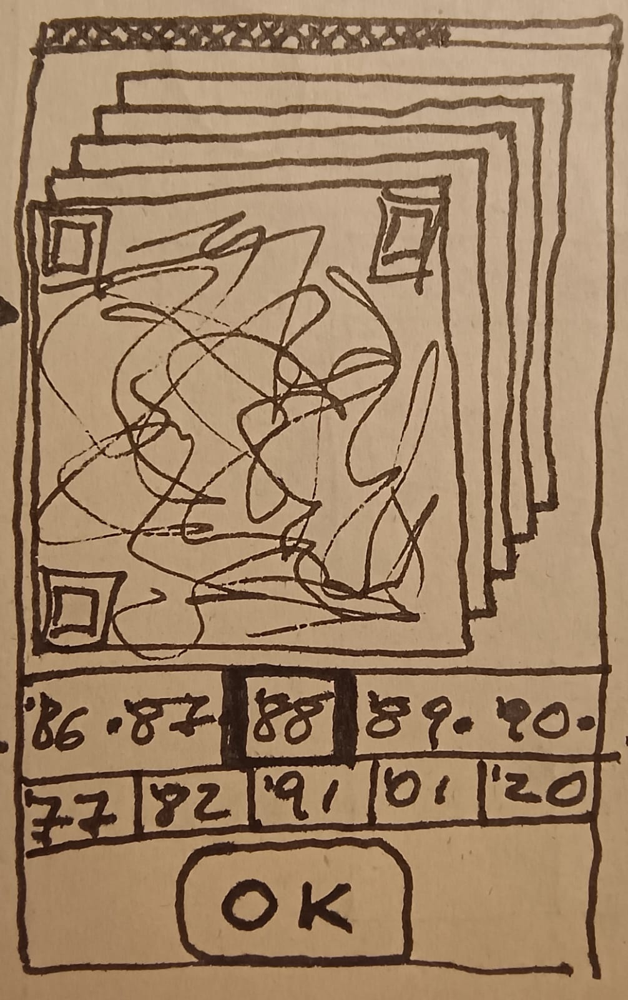

# Musikquizkampen 🎵

Un juego interactivo de trivia musical donde debes ordenar canciones en una línea de tiempo según su año de lanzamiento.

Este es el primer boceto del mismo, en papel:

## 🎮 Cómo jugar

1. Selecciona una carta con código QR
2. Escanea el QR o presiona "Play" para escuchar la canción
3. Arrastra la carta a la línea de tiempo según el año que crees que fue lanzada
4. ¡Gana puntos por cada respuesta correcta!

## ✨ Características

- **8 canciones** de diferentes décadas (1945-2018)
- **5 canciones aleatorias** por partida para mayor rejugabilidad
- **Sistema drag & drop** intuitivo
- **Códigos QR** para escuchar en Spotify
- **Reproductor integrado** para escuchar directamente en el navegador
- **Sistema de puntuación** (+20 puntos por acierto)
- **Timeline dinámico** que se construye con tus respuestas
- **Interfaz responsive** optimizada para móvil y desktop

## 🚀 Demo en vivo

[Jugar ahora](https://tu-usuario.github.io/juego)

## 🛠️ Tecnologías

- HTML5
- CSS3
- JavaScript vanilla
- [qrcode](https://www.npmjs.com/package/qrcode) - Generación de códigos QR

## 📝 Versión actual: v0.8

### Últimas actualizaciones

- Modal de Profile con estadísticas (partidas, puntos, promedio)
- Modal de Ranking con historial de partidas y nombres de jugadores
- Ranking sin duplicados por jugador/usuario registrado
- Modal de Contact Us con formulario de 400 caracteres
- Modal de Instrucciones con 5 pasos ilustrados
- Opción Hacks solo visible para usuarios admin
- Botón Logout en menú
- Nombres de jugadores precargados
- Tiempo de respuesta aumentado a 1 minuto
- Integración completa con Firebase Firestore

## 📄 Licencia

Este proyecto es de código abierto y está disponible bajo la licencia MIT.
